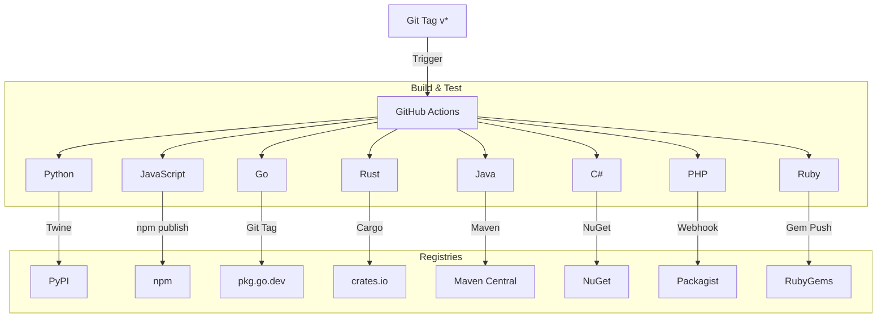

# SDK Monorepo Architecture

This repository hosts the 8 language SDKs for the ErrorDebugger platform.

## Directory Structure
```
├── .github/workflows/publish-sdks.yml  (GitHub Actions Orchestrator)
├── python/                             (PyPI Package)
├── javascript/                         (npm Package)
├── go/                                 (Go Module)
├── rust/                               (Crate)
├── java/                               (Maven Project)
├── csharp/                             (NuGet Package)
├── php/                                (Composer Package)
└── ruby/                               (Gem)
```

## CI/CD Pipeline

The publishing process is fully automated via GitHub Actions.



## Publishing Flow
1.  **Trigger**: A git tag (e.g., `v0.2.4`) is pushed.
2.  **Validation**: Each SDK job runs in parallel.
3.  **Secrets**: Registry tokens are stored in GitHub Secrets.

## Release Process
See [RELEASE.md](./RELEASE.md) for instructions on bumping versions and triggering a release.
